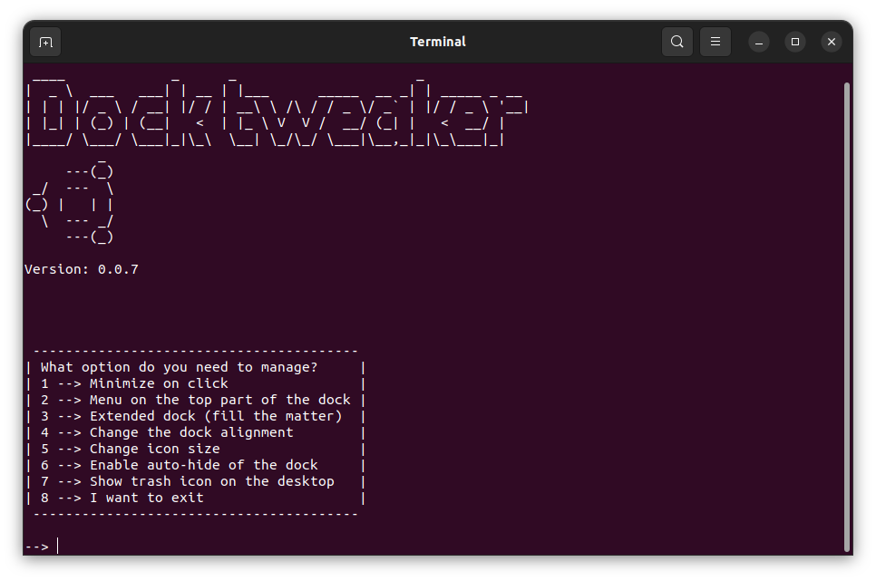

# Ubuntu dock tweaker CLI/TUI
The goal of the project is to make it possible to tweak Ubuntu dock with no GUI app installed, all you have to do is to run the script



## How to use it?
First of all, you need to 
```
git clone https://github.com/LambLeeg/Ubuntu-dock-tweaker-CLI-TUI.git
```
 from a terminal within the dirrectory you want it to be.

1. Now, open the cloned folder in a terminal, and write `./tweaker.py`
2. The second method is to open Files and right click the `tweaker.py`, then click "Run as a program" (works for Ubuntu)
3. Look at the releases section on the right side, there is a one package R (LTS) version for you!
___

## QA
1. How it works?
- These are simple, and easy to write Python files; they are made as modules to ease the coding

2. What is the difference between a normal release and R release?
- The normal release is for implementation of new stuff, meanwhile as R for a sort of _LTS_ release for a long term usage

3. Why would I use it?
- Well, it's made for people who want a program that is not relying on GUI but makes its work

4. Why it's FOSS?
- Because I do believe that free and open source is the power of openness
___

## Will it have something else?
Well, in a nutshell, yes; I am going to add some stuff

## Troubleshooting
There is a little chance that cloned files won't work, then just use `chmod +x tweaker.py` at the cloned folder or right click --> Properties --> Permissions --> Allow executing file as a program, and now give it a second shot!

___
## Update history

### Version 0.0.1
- Minimize on click
- Move application menu on top of the dock

#### Changelog:
- The 'disable' feature is now workable

### Version 0.0.2
- Extended dock

#### Changelog:
- Added the Extended option
- Now, the core file is name just `tweaker.py` instead of long name that make cause some troubles

Bugs:
- script doesn't make anything to system

### Version 0.0.3
- The fixes of bugs and errors

#### Changelog:
- Now, everything just works, before 'disable' could do nothing
- Options 'YES' and 'NO' were changed to 1 and 2

### Version 0.0.4
- Now you can change the position of a dock

#### Changelog:
- Added the new option to choose where dock is placed
- Spelling mistakes are fixed

## Version 0.0.5 R
- Now you can change the size of icons

#### Changelog
- Added 'change icon size' option
- Added a small arrow at input area

Bugs:
- Arrow of the input area wasn't correct

### Version 0.0.6
- Added auto-hide option

#### Changelog
- Added 'auto-hide' option
- Arrow bug is fixed
